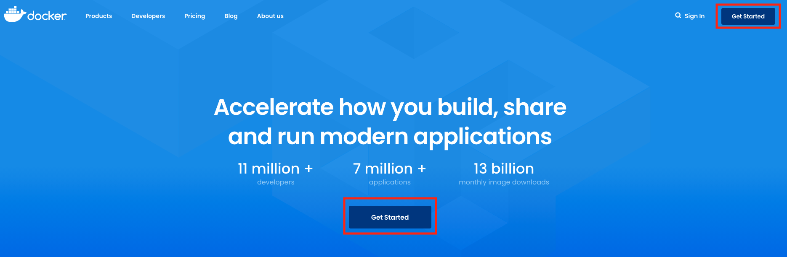
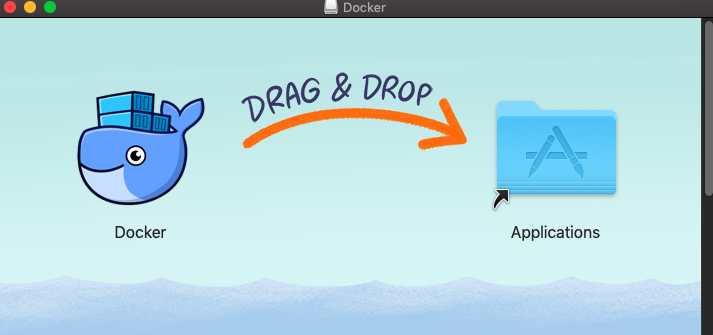
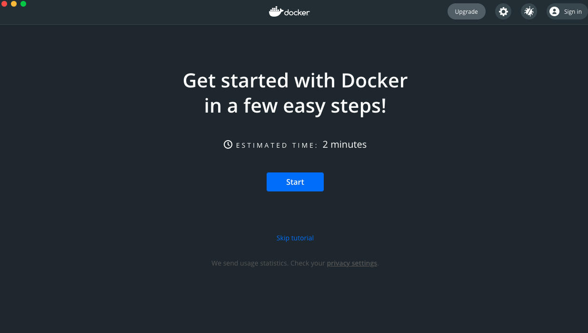
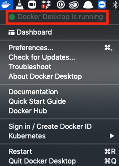
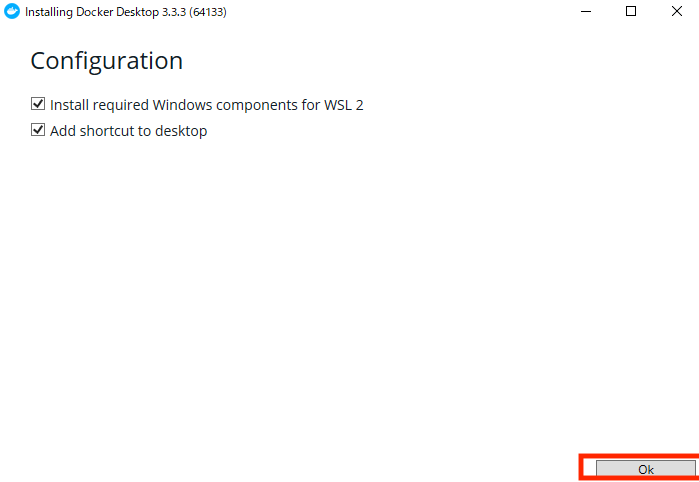
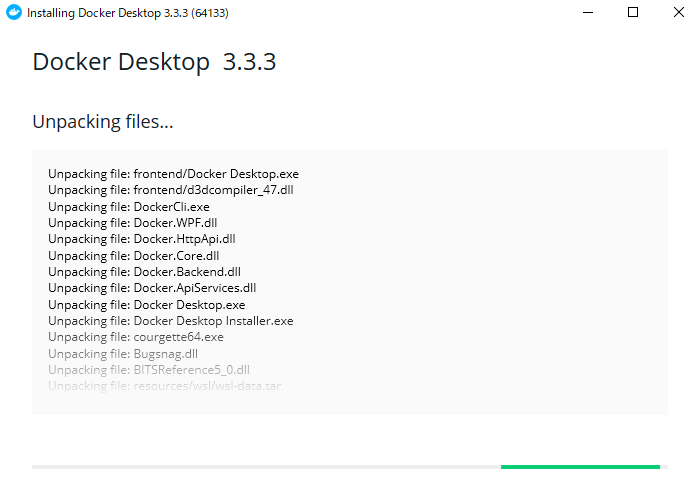
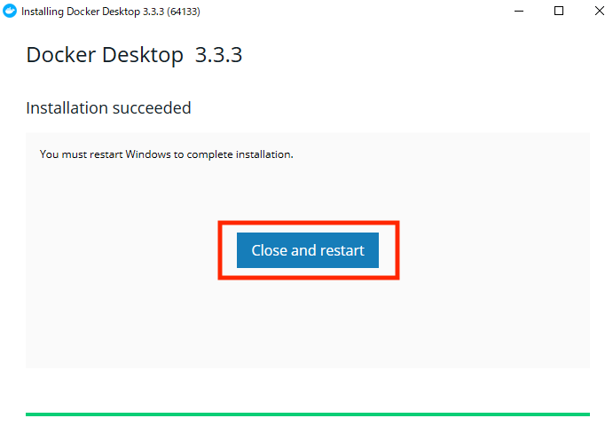
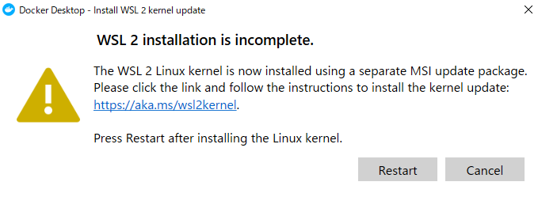
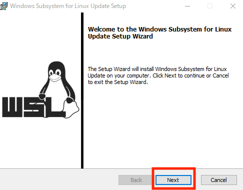

# Dockerのインストール
ここでは、第2章p.66のコラムにて紹介をしたDockerについて、macOS, WindowsそれぞれのOSでインストールする方法を説明します。どちらのOSでも複数のインストール方法がありますが、ここでは最も簡単なDocker Desktopを利用したインストール方法を取り上げます。

## macOS
### インストール手順
[公式ページ](https://www.docker.com/)にアクセスし、「Get Started」をクリックします（図1）。このとき、「Sign in」というボタンもありますが、アカウントを作成するといった作業は必要ありません。




「Download for Mac - Intel Chip」をクリックしてインストールファイルをダウンロードします（図2）[^m1mac]。

[^m1mac]: 2020年に発売された M1 Macの場合、マウスオーバーで現れる「Download for Mac - Apple Chip」からダウンロードし、インストールする必要があります。


「Docker.dmg」というファイルがダウンロードされますので、ダブルクリックし、Dockerをアプリケーションフォルダにドラッグアンドドロップします(図3)。



FinderからDockerをダブルクリックし、起動します。すると、図4のような画面が現れます。このウィンドウは閉じても構いません。



ウィンドウを閉じたときに、画面上部のツールバーにクジラのアイコンが常駐し、クリックしたときに「Docker Desktop is runnning」となっていることを確認してください（図5）。



Docker Desktopは、macを再起動した際に自動的に立ち上がります。

### 動作確認
ターミナルを開き、以下のコマンドを入力します。


```sh
docker --version
```

このとき、エラーがなく以下のようにDockerのバージョンが表示されれば、Dockerが動作していることが確認できます。なお、以下の出力結果は筆者が本ページを執筆した際のバージョンであり、実行時期によってはもっと新しいバージョンが表示されます。また、`build` の後にある記号の並びも、バージョンによって異なります。

```
Docker version 20.10.6, build 370c289
```

## Windows
ここでは、Windows 10 Home Edition を基準に説明をします。他のWindowsの場合、下記の方法では一部表示が異なる、またはインストールに失敗することがあります。

### インストール手順
[公式ページ](https://www.docker.com/)にアクセスし、「Get Started」をクリックします（図6）。このとき、「Sign in」というボタンもありますが、アカウントを作成するといった作業は必要ありません。


「Download for Windows」をクリックしてインストールファイルをダウンロードします（図7）。


「Docker Desktop Install.exe」というファイルがダウンロードされますので、ダブルクリックし、インストールを開始します。

このとき、「このアプリがデバイスに変更を加えることを許可しますか?」という質問が表示されますので、「はい」をクリックします。

すると、図8のようなインストール準備開始画面が現れるので、チェックはデフォルトのまま、「OK」をクリックします。



すると図9のような画面でインストールが進行しますので、数分待ちます。



インストールが終わると、図10の画面になるので、「Close and restart」をクリックします。



Docker自体のインストールはこれで完了です。しかし、Dockerを動かすためにいくつか追加でインストールをしなければならないものがあります。

Windowsが再起動すると、図11のような画面が現れます。**この画面は閉じずに、中央の「 https://aka.ms/wsl2kernel 」のリンクをクリックします。**


すると、ブラウザでリンクが開くので、「x64 マシン用 WSL2 Linux カーネル更新プログラムパッケージ」をクリックし、インストールファイルをダウンロードします（図12）。


このとき、「wsl_update_x64.msi」というファイルがダウンロードされますので、ダブルクリックをして実行します。

このとき、「このアプリがデバイスに変更を加えることを許可しますか?」という質問が表示されますので、「はい」をクリックします。

図13のような画面が現れるので、「Next」をクリックし、インストールを開始します（こちらのインストールは素早く終わるはずです）。



完了したら、「Finish」をクリックして画面を閉じます。

ここで、Windowsを再起動した際の画面で「Restart」をクリックします（図14）。このとき再起動するのはWindowではなくDockerプロセスになります。


これで、Dockerを動かす準備が整いました。これ以降、Windowsを起動した際は自動でDockerが起動します。

### 動作確認
コマンドプロンプトを開き、以下のコマンドを入力します。


```sh
docker --version
```

このとき、エラーがなく以下のようにDockerのバージョンが表示されれば、Dockerが動作していることが確認できます。なお、以下の出力結果は筆者が本ページを執筆した際のバージョンであり、実行時期によってはもっと新しいバージョンが表示されます。また、`build` の後にある記号の並びも、バージョンによって異なります。

```
Docker version 20.10.6, build 370c289
```
